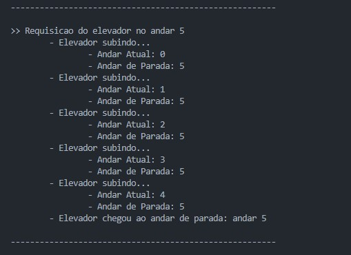

# Simulação de Elevador

### Integrantes
- Vitor Alves Pereira, 10410862
- Eduardo Takashi Missaka, 10417877
- Tiago Silveira Lopez, 10418683

### Descrição
Este sistema simula o funcionamento de um elevador em um prédio com 6 andares. Ele utiliza threads para gerenciar as requisições do elevador e seu movimento entre os andares. A estrutura do programa é baseada em um modelo de concorrência, onde duas threads foram criadas para processar as requisições do elevador, garantindo que o sistema funcione de maneira eficiente e responsiva.

### Lógica de Concorrência e Sincronização
O código implementa a lógica de concorrência através da criação de threads para gerenciar a requisição e o movimento do elevador, além da correta utilização de mutex:
•	**Threads:** O sistema cria uma thread para lidar com cada requisição de elevador e outra para mover o elevador. Isso permite que o sistema atenda múltiplas requisições de forma assíncrona.
•	**Mutex:** O uso de pthread_mutex_t é fundamental para garantir que apenas uma thread possa acessar ou modificar as estruturas de dados (Building e Elevator) ao mesmo tempo. Isso evita que duas threads tentam modificar as mesmas informações simultaneamente.

### Design
- **Estruturas Separadas:** A utilização de estrutura de dados foi fundamental para organização e clareza no armazenamento de variáveis.
- **Uso de Threads:** A implementação de um sistema com threads permite que o código simule melhor o comportamento de um elevador real em um prédio.
- **Bloqueio e Desbloqueio com Mutex:** O uso de mutexes foi decidido para garantir a segurança no acesso às variáveis compartilhadas.

### Comportamento do Sistema
- **Requisições:** O elevador é chamado de um andar aleatório, gerado pela função request(). Quando chamado, o sistema imprime o andar de chamada e atualiza a propriedade elevator_call na estrutura Building.
- **Movimentação:** Após a requisição, a função move_elevator() é chamada, e o elevador começa a se mover em direção ao andar de destino, imprimindo sua posição atual até chegar ao destino.
- **Encerramento do Programa:** O código foi implementado para que o elevador fique rodando em um loop infinito, sem definição de fim.

### Simulação

### Conclusão
Essa documentação fornece uma visão abrangente do código, destacando as decisões de design, a lógica de concorrência e o comportamento do sistema, cumprindo, portanto, seu papel em esclarecer as funcionalidades gerais do sistema.
